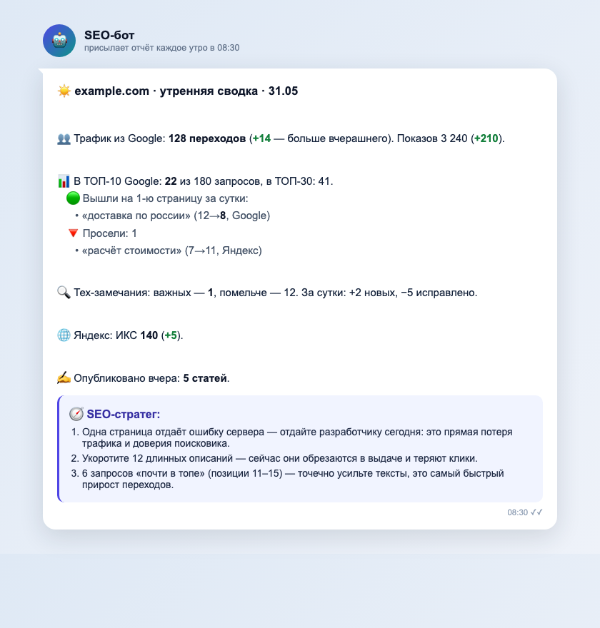

# SEO-завод · стартовый шаблон

[](LICENSE)
[](https://github.com/vasin-k-i/seo-factory-starter/generate)
[](#)
[](#)
[](#)
[](#)
[](#)

Автоматический SEO: агенты в GitHub Actions каждое утро присылают в Telegram
короткий понятный отчёт — трафик, позиции, технические ошибки и **что сделать
сегодня** живым языком (через Claude). Плюс контент-фабрика, которая сама пишет
статьи в блог, и пинги быстрой индексации.

<p align="center">
  
</p>
<p align="center"><sub>Так выглядит утренний отчёт в Telegram. Данные на скриншоте обезличены (example.com).</sub></p>

> Подробное «почему так» и стратегия — в сопроводительном PDF-руководстве.
> Этот репозиторий — рабочий код. Жмёте **Use this template**, кладёте ключи,
> и у вас такой же SEO-завод.

---

## Что внутри

```
seo-agent/                 # «мозг» (Python), запускается в GitHub Actions
  orchestrator.py          # единая точка входа: python orchestrator.py <команда>
  modules/                 # M1–M6, дайджест дня, стратег, недельный разбор, клиенты API
  notifiers/               # Telegram + «человеческий язык» (humanize)
  scripts/ping_new_urls.py # пинг переобхода после публикации
content-factory/           # генератор статей (бриф → текст → редактура через Claude)
  prompts/                 # ШАБЛОНЫ промптов — адаптируйте под свою нишу
  usage_ledger.py          # учёт расхода LLM: токены и доллары в data/budget/usage.jsonl
  queue_lease.py           # файловый лок на очередь тем: два прогона не берут одни темы
  circuit_breaker.py       # предохранитель: счётчики повторов и правок за сутки
.github/workflows/         # расписания (cron) + ручной запуск
```

| Команда | Что делает | Cron (МСК) |
|---|---|---|
| `orchestrator.py daily` | утренний дайджест + мини-аудит + SEO-стратег | ежедневно 08:30 |
| `orchestrator.py m3` | трекинг позиций (Google + Яндекс) | ежедневно 06:00 |
| `orchestrator.py m2` | технический аудит + Core Web Vitals | сб 07:00 |
| `orchestrator.py m1` | семантика → темы для фабрики | вс 04:00 |
| `orchestrator.py dupes` | дубли коммерческих страниц, каннибализация, порог тегов, покрытие карты | вручную / раз в месяц |
| `orchestrator.py digest` | недельный разбор | пн 11:00 |
| контент-фабрика | 5 статей/день (Batch API, −50%) | ежедневно 09:00 |

---


### Модуль `dupes` — то, за что обычно платят внешнему аудитору

Четыре проверки, которых нет в типовом SEO-конвейере, хотя всё видно из статики:

1. **Near-dupes коммерческих страниц.** Доля общих 5-словных сочетаний по зоне
   `<main>` (шапка/подвал исключены). Мера — контейнмент от МЕНЬШЕГО из двух
   текстов, не Жаккар: страница на 4 000 символов, целиком повторённая внутри
   страницы на 20 000, должна давать 100%, а Жаккар покажет 20% и спрячет проблему.
   Контроль: две случайные статьи блога дают 7% — метод не завышает.
2. **Пары «посадка ↔ статья» с близкими title** — кандидаты в каннибализацию.
3. **Порог индексации тегов** и что даст каждый вариант порога.
4. **Покрытие sitemap** — с отсевом ОСОЗНАННЫХ исключений (noindex, чужой
   canonical, редирект), иначе модуль каждый раз требует «починить» специально
   сделанное.

Настройка под свой сайт:

```bash
export SITE_URL="https://example.com"
# группы ОДНОТИПНЫХ страниц — сравнивать имеет смысл их, а не всё со всем
export DUPES_GROUPS='{"услуги":["/uslugi/a","/uslugi/b"],"посадки":["/lp-1","/lp-2"]}'
# или собрать карточки автоматически со страницы-каталога
export DUPES_CATALOG_PATH="/katalog"
export DUPES_CATALOG_ITEM_RE="/katalog/[a-z0-9-]+"

python3 seo-agent/orchestrator.py dupes --json
```

⚠️ Если корпуса статей нет, проверка тегов вернёт `data_gap`, а не нули: «не
считали» и «ноль» — разные вещи, и подавать их одинаково нельзя.

## Быстрый старт (5 минут с Claude Code)

1. **Use this template** → создайте репозиторий из этого шаблона (или склонируйте).
2. Откройте папку репозитория в **Claude Code** и вставьте промпт ниже.
3. Claude по очереди спросит ключи, положит их в GitHub Secrets, настроит домен и проверит доступы. Больше ничего вводить не нужно.

````text
Подними SEO-завод в этом репозитории. Действуй так:

1. Определи репозиторий (gh repo view --json nameWithOwner) и спроси у меня
   домен сайта. Пропиши в .github/workflows/seo-*.yml и content-factory.yml:
     GSC_SITE_URL=sc-domain:<домен>, SEO_SITE_DOMAIN=<домен>,
     M2_SITE_ROOT=https://<домен>

2. Запроси у меня ПО ОЧЕРЕДИ и положи в GitHub Secrets через
   `gh secret set <ИМЯ>` (значения в логи не выводи):
     ANTHROPIC_API_KEY, GSC_OAUTH_CLIENT_ID, GSC_OAUTH_CLIENT_SECRET,
     GSC_OAUTH_REFRESH_TOKEN, YANDEX_WEBMASTER_TOKEN, PSI_API_KEY,
     TELEGRAM_BOT_TOKEN, TELEGRAM_CHAT_ID
     (опционально — позиции Яндекса: TOPVISOR_API_TOKEN, TOPVISOR_USER_ID,
      TOPVISOR_PROJECT_ID; индексация: INDEXNOW_KEY)

3. Если у меня ещё нет GSC refresh-токена — проведи через
   seo-agent/modules/gsc_oauth_setup.py (интерактивный вход в Google).
   Напомни опубликовать OAuth-приложение в Production, иначе токен
   протухнет через 7 дней.

4. Проверь доступы живыми запросами (gsc_client, yandex_webmaster, telegram)
   и запусти dry-run: `cd seo-agent && python3 orchestrator.py daily --dry-run`.
   Покажи результат. Если зелёное — расписания уже работают, отчёты пойдут утром.
````

---

## Скиллы для работы с сайтом

Завод пишет статьи, но сам сайт всё равно верстается и правится руками. Чтобы Claude Code
делал это не «как получится», в репозитории лежат два скилла — ставятся одной командой
и работают потом в любой папке:

```bash
./install-skills.sh
```

| Скилл | Когда срабатывает | Что даёт |
|---|---|---|
| `anti-neuroslop` | перед вёрсткой страницы, лендинга, секции, редизайном, показом макета | стоп-лист приёмов, по которым сразу видно «делала нейронка» |
| `conversion-ux` | перед сборкой лендинга, страницы услуги, формы, квиза; при разборе «почему не конвертит» | правила, по которым страница приносит заявки, а не просто выглядит |

Они дополняют друг друга: первый отвечает за «не выглядит как нейронка», второй — за
«приносит деньги». При конфликте побеждает правило, которое запрещает ложь.

`conversion-ux` идёт **вместе со своей базой** — 14 разделов системы (ядро из 14 законов,
первый экран, доверие и доказательства, формы и CTA, типы страниц от лендинга услуги
до квиза, мобильный и скорость, право РФ, измерение и тесты), сжатый system-prompt
для генератора, чеклист приёмки и разметка источников по достоверности A/B/C.
Собрана из первичных исследований (Baymard, NN/g, Unbounce, Zuko, web.dev),
вендорских бенчмарков, разборов и парсинга живых российских лендингов.

Скиллы подхватываются при **старте** сессии — если Claude Code уже открыт, перезапустите.

**Что стоит доставить отдельно.** В комплект не кладём — это чужие скиллы со своими
лицензиями, и копировать их в шаблон было бы неправильно.

Ставится одной командой из официального маркетплейса Anthropic:

```
/plugin marketplace add anthropics/claude-plugins-official
/plugin install frontend-design@claude-plugins-official
```

`frontend-design` — генерация интерфейсов без «шаблонной ИИ-эстетики»; ближайший
сосед наших двух скиллов, хорошо ложится поверх них.

Отдельным репозиторием:

- **Разведка ниши** — go/no-go по нише до того, как строить сайт: спрос, конкуренты,
  деньги-страницы, контент-план. [vasin-k-i/razvedka-nishi](https://github.com/vasin-k-i/razvedka-nishi).

Остальное ищите по названию в маркетплейсах Claude Code — прямых ссылок не даём,
потому что источники у них не заявлены, а угадывать URL нельзя:

| Скилл | Про что | На что смотреть |
|---|---|---|
| `impeccable` | большой набор для аудита и полировки интерфейса, есть детектор антипаттернов | Apache 2.0, Paul Bakaus — лицензия позволяет использовать, но это отдельный продукт |
| `ui-ux-pro-max` | библиотеки стилей, палитр, шрифтовых пар, типов продуктов | ~1,8 МБ, лицензия не заявлена |
| `high-end-visual-design`, `design-taste-frontend`, `apple-design`, `emil-design-eng` | вкусовые системы: типографика, тени, отступы, моушен | однофайловые, лицензия не заявлена |
| `redesign-existing-projects`, `image-to-code` | редизайн legacy-сайта; вёрстка по картинке макета | лицензия не заявлена |
| `scrapling-official` | парсинг, когда сайт конкурента не читается (403, антибот, JS) | нужен при анализе выдачи |

## Ключи и где их взять

| Секрет | Зачем | Где взять |
|---|---|---|
| `ANTHROPIC_API_KEY` | Claude: стратег, M1, тексты | console.anthropic.com |
| `GSC_OAUTH_CLIENT_ID/SECRET/REFRESH_TOKEN` | Google Search Console | Google Cloud Console → OAuth Client; refresh-токен — `gsc_oauth_setup.py` |
| `YANDEX_WEBMASTER_TOKEN` | Яндекс.Вебмастер | OAuth Яндекса (scope webmaster:hostinfo,verify) |
| `PSI_API_KEY` | PageSpeed / Core Web Vitals | Google Cloud Console → PageSpeed Insights API |
| `TELEGRAM_BOT_TOKEN` / `TELEGRAM_CHAT_ID` | доставка отчётов | @BotFather; chat_id — @userinfobot |
| `TOPVISOR_*` *(опц.)* | позиции в Яндексе | topvisor.com → Настройки → API |
| `INDEXNOW_KEY` *(опц.)* | быстрая индексация | сгенерируйте ключ, положите в `public/<key>.txt` |
| `YANDEX_CLOUD_API_KEY` + `YC_FOLDER_ID` *(опц.)* | частотность Вордстата, бесплатно | Yandex Cloud → сервисный аккаунт с ролью `search-api.webSearch.user` |
| `XMLRIVER_USER` + `XMLRIVER_KEY` *(опц.)* | частотность + живая выдача Яндекса/Google | xmlriver.com → личный кабинет |
| `ARSENKIN_API_TOKEN` *(опц.)* | частотность пачкой + SERP-кластеризация | arsenkin.ru → профиль (нужен тариф с API) |

Per-сайт (в workflow, не секреты): `GSC_SITE_URL`, `SEO_SITE_DOMAIN`, `M2_SITE_ROOT`.

### Частотность спроса (`modules/freq.py`)

До этого модуля поле `wordstat_frequency` в бэклоге тем было заглушкой `0`: модель
частотностей не знает, и темы приоритезировались только по показам из Вебмастера/GSC —
то есть по тому, где сайт **уже** показывается. Спрос, которого вы ещё не касались,
оставался невидимым.

Теперь M1 проставляет темам реальную частотность. Источники подключаются по цепочке,
каждый следующий закрывает дыру предыдущего — ключей нет вообще, поле останется `0`
и всё работает как раньше:

| Источник | Как берёт | Ограничение | Цена |
|---|---|---|---|
| кэш `~/.seo-freq/cache.json` | общий на все ваши проекты | — | 0 |
| Yandex Cloud Wordstat | по одной фразе | **100 запросов в час** на аккаунт | 0 |
| XMLRiver | по одной фразе | — | ~25 ₽/1000 |
| Arsenkin Tools | **пачкой за одну задачу** | тариф с API | ~0,02–0,03 ₽/фраза |

```bash
python3 seo-agent/modules/freq.py "купить котёл" "котёл цена"   # разовая проверка
python3 seo-agent/modules/freq.py --in phrases.txt --out f.json # пакетно
python3 seo-agent/modules/freq.py --stats                        # кэш и расход за сегодня
python3 seo-agent/modules/freq.py --in phrases.txt --no-paid     # только бесплатное
```

⚠️ **Главная ловушка, ради которой всё это написано.** Wordstat на исчерпанной квоте
возвращает **пустой ответ, а не ошибку**. Наивный код читает это как «частотность 0»,
то есть «спроса нет», и тема тихо выбывает. На реальном замере 503 страниц так
получилось «93% страниц без спроса» вместо честных 40–48%.

Правило: **отсутствие фразы в ответе `frequency()` — это «не замерили», а не «спроса нет».**
Такие темы остаются с `0` и в приоритете НЕ понижаются — их надо домерить позже.

**Потолок трат.** `SEO_DAILY_RUB_LIMIT=100` в `.env` ограничивает платные запросы
100 ₽ в сутки на этот проект; журнал — `~/.seo-freq/spend.json`, посмотреть `--stats`.
Без переменной лимита нет. Wordstat в расход не идёт — он бесплатный.

### Выдача, позиции и кластеризация (`modules/serp.py`) — нужен XMLRiver

Работает **только при заполненных `XMLRIVER_USER` + `XMLRIVER_KEY`** (без них команды
молча вернут пусто). Один запрос = одна страница выдачи (10 позиций) = 0,025 ₽.

```bash
python3 seo-agent/modules/serp.py top "запрос" --depth 30          # кто в топе
python3 seo-agent/modules/serp.py pos ваш-домен.ru --in q.txt      # ваши позиции
python3 seo-agent/modules/serp.py cluster --in q.txt --out cl.json # группировка по выдаче
python3 seo-agent/modules/serp.py top "query" --engine google      # то же по Google
```

Зачем это в заводе:

- **Позиции.** Своя проверка вместо подписки на трекер: 0,025 ₽ против ~0,09 ₽ у сервисов.
- **Кластеризация по выдаче.** Два запроса идут в одну статью, только если их топы делят
  ≥3 общих URL. Это отвечает на вопрос «одна страница или две» **данными поисковика**,
  а не ощущением — и заодно защищает от каннибализации, когда две ваши статьи дерутся
  за один запрос. Порог задаётся `--threshold`: 3 при глубине 10 — рабочий компромисс,
  4–5 жёстче и дробит на мелкие группы.
- **Топ конкурентов** — сырьё для «сделать объёмнее любого из топа»; URL остаются у вас
  и переиспользуются, а не оплачиваются заново при каждом анализе.

Проверка на живой нише (педагогическое СПО): четыре формулировки одного интента
(«педагогический колледж дистанционно», «педколледж дистанционно», «…дистанционное
обучение», «дистанционный педагогический колледж») собрались **в один кластер**,
а «дошкольное образование заочно» и «начальное образование дистанционно» остались
раздельными — то есть под них нужны разные страницы. Это и есть правильный ответ.

⚠️ Сервис штатно отдаёт `<error code="500">Выполните перезапрос` — это просьба
повторить, а не отказ. В модуле есть ретрай; если писать свой запрос — не забудьте,
иначе «нас нет в топе» окажется просто несостоявшимся запросом.

---

## Важно

- **Агенты работают в GitHub Actions, а не на сервере сайта** — так задумано: Claude API недоступен с некоторых регионов, а раннеры GitHub в США/ЕС.
- **Один аккаунт — все сайты.** Токены Google/Яндекс/Anthropic/Telegram привязаны к аккаунту, переиспользуются на нескольких проектах — меняется только домен.
- **URL только латиницей.** Кириллица в слагах ломает маршрут и sitemap.
- **Контент-фабрика и промпты `content-factory/prompts/` — это ШАБЛОНЫ.** Перед запуском адаптируйте их под свою нишу, бренд и стиль. AI-тексты публикуйте только после проверки фактов.
- **Статьи выходят не «голым текстом».** Каждая MDX-статья уже несёт frontmatter
  `author`/`authorRole`/`cover`/`coverAlt` и 2–4 картинки-плейсхолдера по тексту
  (обычный markdown ``, включая одну инфографику,
  если тема того стоит) — с содержательным alt-текстом, но без реальных файлов.
  Замените имена авторов в `content-factory/prompts/02_article_writer.md` на своих,
  подставьте реальные картинки под плейсхолдеры и решите на своём сайте, что
  делать с путём `/images/blog/...` — фабрика картинки не генерирует и не грузит.
- **Никогда не коммитьте `.env` и `secrets/`** — они в `.gitignore`. В репозиторий идут только `*.example`.
- **Смотрите, сколько тратите.** Каждый вызов Claude пишется строкой в `content-factory/data/budget/usage.jsonl` (токены + доллары по официальному прайсу). Сводка: `python3 content-factory/usage_ledger.py 7` — за сегодня и за 7 дней. Это только учёт: лимитов и автоостановки по бюджету тут нет. Состояние предохранителя — `python3 content-factory/circuit_breaker.py`.

## Лицензия
MIT — см. `LICENSE`. Используйте свободно.
